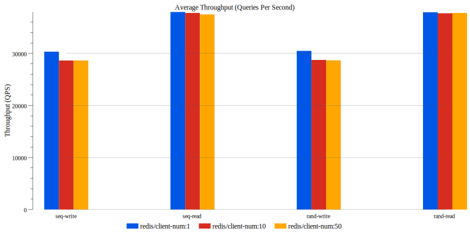
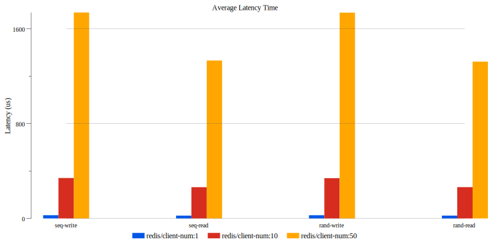

# redisgo

redisgo is a Go Client for Redis (http://redis.io).

Some features include
* minimal, high performance
* based on redis protocol 2.0, support for all redis types and commands
* connection pooling support
* thread safe (goroutine safe)

## Start
redisgo use redisgo.NewConnector(redisgo.Config{...}) to create connection with Redis server. You can use redisgo.Config to set host, port, pool size, timeout, etc.

``` go
package main

import (
	"github.com/lynkdb/redisgo"
)

func main() {
	conn, err := redisgo.NewConnector(redisgo.Config{
		Host:    "127.0.0.1",
		Port:    6379,
		Timeout: 3, // timeout in second, default to 10
		MaxConn: 1, // max connection number, default to 1
		// Auth:    "foobared",
	})
	if err != nil {
		return
	}

	conn.Cmd("set", "key", "value")

	conn.Close()
}
```

Request: all Redis operations go with ```redisgo.Connector.Cmd()```, it accepts variable arguments. The first argument of Cmd() is the Redis command, for example "get", "set", etc. The rest arguments(maybe none) are the arguments of that command.

Examples:
``` go
conn.Cmd("set", "key", "value")
conn.Cmd("incrby", "key-incrby", 1)
conn.Cmd("hset", "key-hash", "field-1", "value-1")
```

## Response

the redisgo.Connector.Cmd() method will return an Object of redisgo.Result

### Response Status

the element of redisgo.Result.Status is the response code. all of the codes include:

* ResultOK
* ResultError  
* ResultNotFound
* ResultBadArgument
* ResultNoAuth
* ResultServerError
* ResultNetworkException
* ResultTimeout
* ResultUnknown
* alias of func redisgo.Result.OK() bool
* alias of func redisgo.Result.NotFound() bool

Examples:
``` go
if rs := conn.Cmd("set", "key", "value"); rs.OK() {
	// ...
}
if rs := conn.Cmd("set", "key", "value"); rs.Status == redisgo.ResultOK {
	// ...
}
```

###	Response Data

use the following method to get a dynamic data type what you want to need.

* redisgo.Result.Bytes() []byte
* redisgo.Result.String() string
* redisgo.Result.Bool() bool
* redisgo.Result.Int() int
* redisgo.Result.Int8() int8
* redisgo.Result.Int16() int16
* redisgo.Result.Int32() int32
* redisgo.Result.Int64() int64
* redisgo.Result.Uint() uint
* redisgo.Result.Uint8() uint8
* redisgo.Result.Uint16() uint16
* redisgo.Result.Uint32() uint32
* redisgo.Result.Uint64() uint64
* redisgo.Result.Float32() float32
* redisgo.Result.Float64() float64
* redisgo.Result.JsonDecode(obj interface{}) error
* redisgo.Result.List() []*Result
* redisgo.Result.KvLen() int
* redisgo.Result.KvList() []*ResultEntry
* redisgo.Result.KvEach(fn func(key, value *redisgo.Result)) int

Examples:

``` go
// example 1
if rs := conn.Cmd("incrby", "key-incrby", 1); rs.OK() {
	fmt.Println("return int", rs.Int())
}

// example 2
var rsobject struct {
	Name string `json:"name"`
}
if rs := conn.Cmd("get", "key-json"); rs.OK() {
	if err := rs.JsonDecode(&rsobject); err == nil {
		fmt.Println("return json.name", rsobject.Name)
	}
}
```

the more examples of result.APIs can visit: [example/example.go](<example/example.go>)

## Performance


### test environment

* CPU: Intel i7-7700 CPU @ 3.60GHz (4 cores, 8 threads)
* OS: CentOS 7.7.1908 x86_64 
* redis: version 5.0.7 (disable save the DB on disk)
* data keys: 40 bytes each
* data values: 1024 bytes each 

### typical performance in client num with 1, 10 and 50:






## Refer URLs
* [Official Redis Protocol specification](https://redis.io/topics/protocol) Redis Protocol specification
* [Official Commands documentation](https://redis.io/commands) complete list of all avilable commands.

## Licensing
Licensed under the Apache License, Version 2.0

